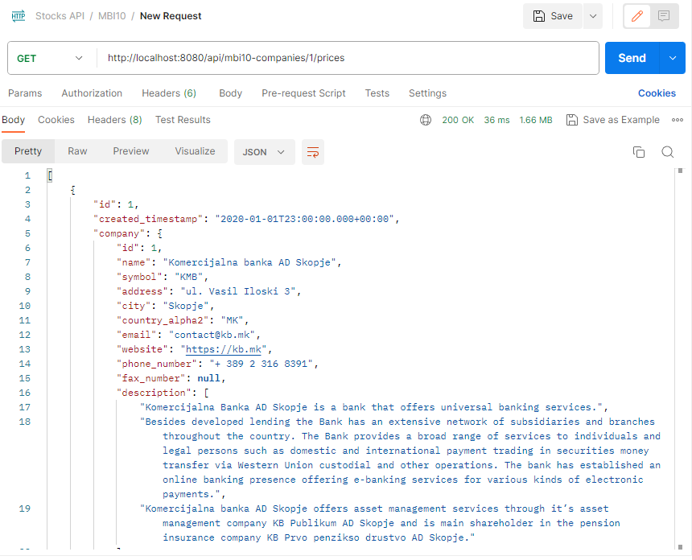

# Stock Exchange Backend Project

This project is a Spring-based backend application that provides data and functionalities for the Macedonian (mbi10), Serbian (belex10), and Slovenian (sbitop) stock exchanges.



## Table of Contents
1. [Introduction](#introduction)
2. [Features](#features)
3. [Prerequisites](#prerequisites)
4. [Installation](#installation)
5. [Configuration](#configuration)
6. [Usage](#usage)
7. [Contributing](#contributing)
8. [License](#license)

## Introduction

This project serves as the backend for stock exchange applications that require real-time data and functionalities for the Macedonian, Serbian, and Slovenian stock exchanges. The application is built using the Spring Framework and provides RESTful APIs to interact with the stock exchange data.

## Features

- Real-time data for the Macedonian (mbi10), Serbian (belex10), and Slovenian (sbitop) stock exchanges.
- Support for retrieving stock prices, historical data, and other relevant stock exchange information.
- Flexible architecture, allowing for easy integration with various frontend applications.

## Prerequisites

Before setting up the project, make sure you have the following prerequisites:

- Java 11 or higher installed on your system.
- Apache Maven for building and managing dependencies.
- An IDE of your choice (e.g., IntelliJ, Eclipse) or a code editor.

## Installation

1. Clone the repository to your local machine:

```bash
git clone https://github.com/simeonmarkoski/macedonian-stock-exchange-back-end.git
```

2. Navigate to the project directory:

```bash
cd stock-exchange-backend
```

3. Build the project using Maven:

```bash
mvn clean package
```

## Configuration

The application requires minimal configuration. However, if you want to customize any settings or add additional data sources, you can do so by modifying the application.properties file located in the src/main/resources directory.

## Usage

1. Run the application using Maven:

```bash
mvn spring-boot:run
```

2. The application will start, and you can access the APIs through the following URL:

```bash 
http://localhost:8080/api
```

## Contributing

We welcome contributions to improve the project. If you find any issues or want to add new features, please open a pull request with a detailed description of your changes.

## License

This project is licensed under the <u><b>MIT License</b></u>.
